# AWP
AdventureWorks DW Project

Data flow diagram
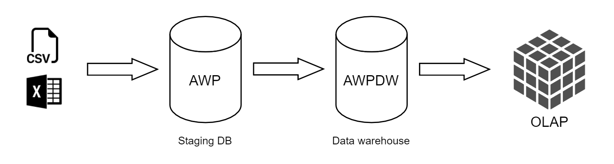

Load data from flat files to staging DB: 
-Products 
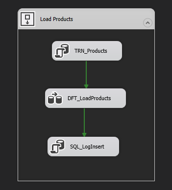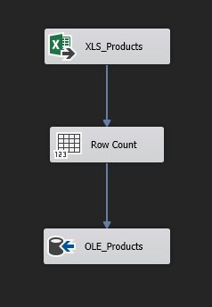
-Customers 
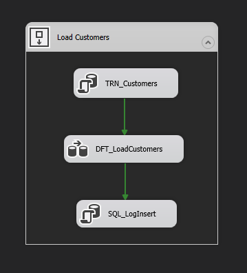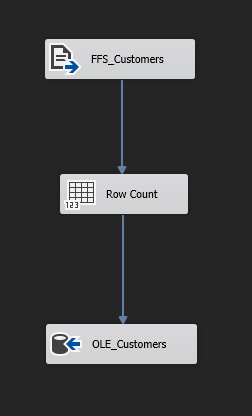
-Calendar 
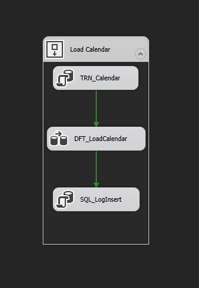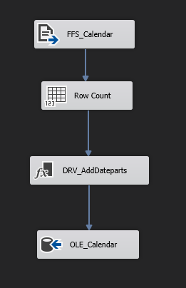
-Sales 
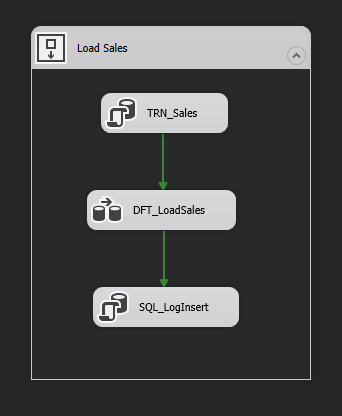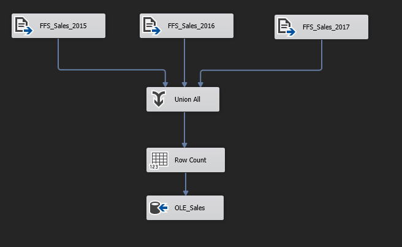

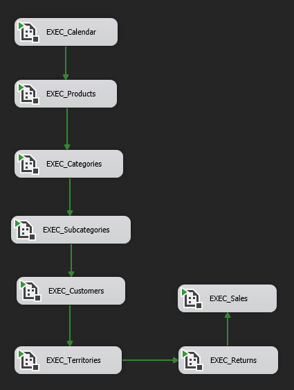

Logging inserted rows:
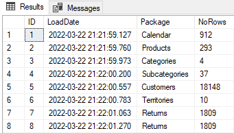

Slowly changing dimesion Categories:
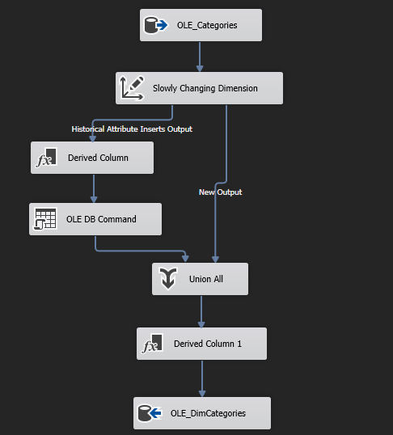

Data cleansing in T-SQL:
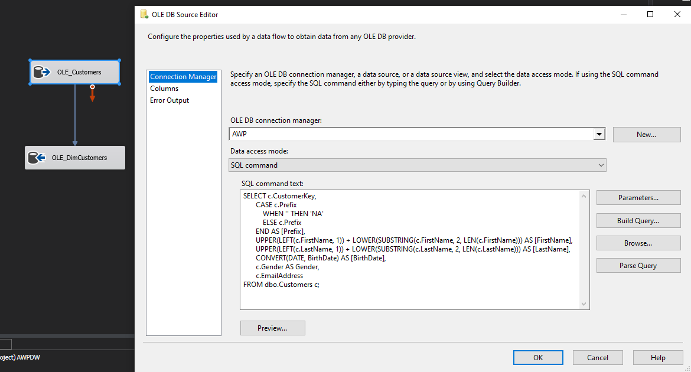

Load dimensions and facts tables from staging DB to DW:
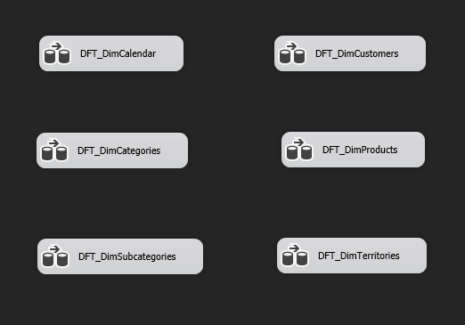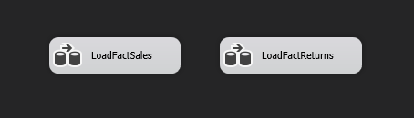

Data from DW is processed to OLAP database ([AWPOLAP Project](https://github.com/maciejsss/AWPOLAP)):
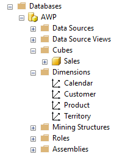

Sales cube:

All previous stages combined in one SQL job: 

SSIS execution report:
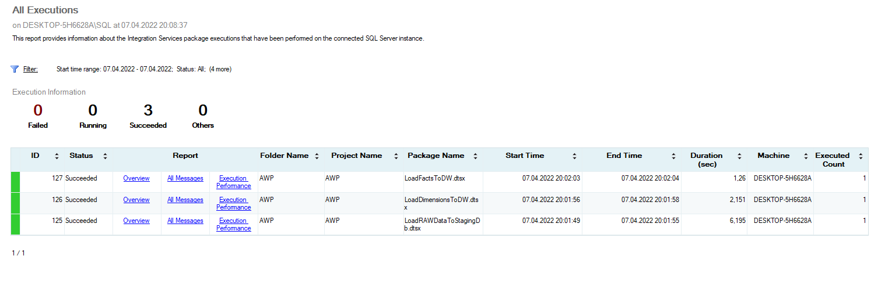

