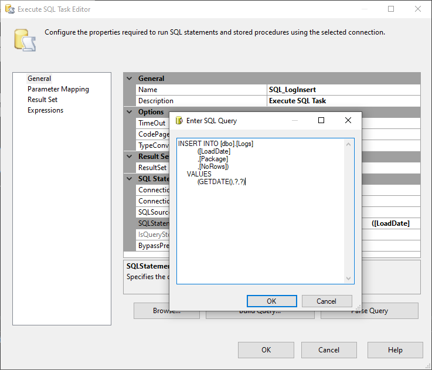
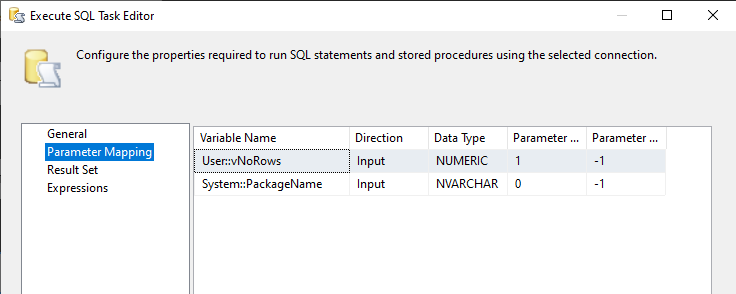

# AWP
**AdventureWorks DW Project**

## Data flow diagram:

### Load data from flat files to staging DB: 
Products 
 
 
Customers 
 
 
Calendar 
 
 
Sales 
 
 
 
 
Logging inserted rows: 
 
 
 
 
Load dimensions and facts tables from staging DB to DW: 
 
 
Slowly changing dimesion Categories: 
 
 
Data cleansing in T-SQL: 
 
 

### Data from DW is processed to OLAP database ([AWPOLAP Project](https://github.com/maciejsss/AWPOLAP)): 
 
 
Sales cube: 
 
 

### All previous stages combined in one SQL job: 
 
 

### SSIS execution report: 
 

